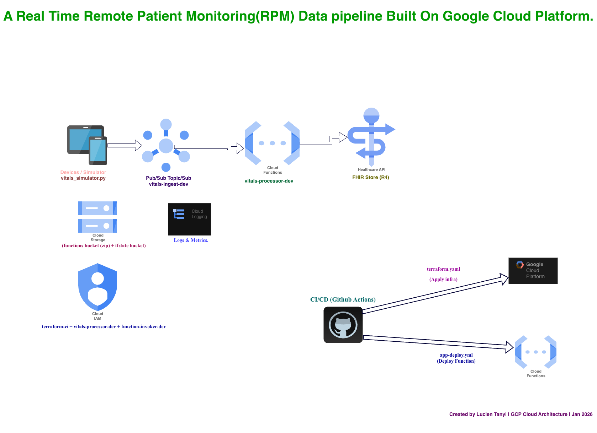

# Remote Vitals Streaming

A real-time **Remote Patient Monitoring (RPM)** data pipeline built on Google Cloud Platform. This project demonstrates how to ingest, process, and store healthcare vital signs using modern cloud-native architecture and DevOps practices.

## Problem Statement

Healthcare providers need to monitor patients remotely in real-time. Vital signs (heart rate, blood oxygen, blood pressure, etc.) must be:
- Ingested from multiple devices simultaneously
- Processed and validated quickly
- Stored in a healthcare-compliant format (FHIR)
- Available for analysis and alerting

This project solves this by building a serverless, scalable pipeline that can handle thousands of vital sign readings per second.


## Architecture


## Tech Stack

| Layer | Technology | Purpose |
|-------|------------|---------|
| **Infrastructure as Code** | Terraform | Provision all GCP resources |
| **Message Queue** | Cloud Pub/Sub | Decouple ingestion from processing |
| **Compute** | Cloud Functions (Gen2) | Serverless event processing |
| **Data Store** | Cloud Healthcare API (FHIR) | Healthcare-compliant data storage |
| **CI/CD** | GitHub Actions | Automated deployment pipelines |
| **State Management** | GCS Backend | Remote Terraform state storage |
| **Authentication** | Workload Identity Federation | Keyless auth (no stored secrets) |
| **Security Scanning** | Checkov | Infrastructure security analysis |

## Project Structure

```
Remote-vitals-streaming/
├── .github/
│   └── workflows/
│       ├── terraform.yml      # Infrastructure pipeline
│       └── app-deploy.yml     # Application pipeline
├── app/
│   ├── vitals-processor/      # Cloud Function code
│   │   ├── main.py            # Function entry point
│   │   └── requirements.txt   # Python dependencies
│   └── simulator/             # Test data generator
│       ├── vitals_simulator.py
│       ├── test_fhir.py
│       └── requirements.txt
├── infra/
│   ├── main.tf                # Main infrastructure resources
│   ├── variables.tf           # Input variables
│   ├── terraform.tfvars       # Variable values
│   ├── provider.tf            # GCP provider config
│   ├── backend.tf             # Remote state config
│   ├── output.tf              # Output values
│   └── workload-identity.tf   # Keyless auth configuration
├── .gitignore
├── CLAUDE.md                  # AI assistant instructions
└── README.md                  # This file
```

## GCP Resources Created

| Resource | Name | Purpose |
|----------|------|---------|
| Healthcare Dataset | `vitals-dev` | Container for FHIR store |
| FHIR Store | `observations` | Stores vital signs as FHIR Observations |
| Pub/Sub Topic | `vitals-ingest-dev` | Receives incoming vitals |
| Pub/Sub Subscription | `vitals-processor-dev` | Triggers Cloud Function |
| Cloud Function | `vitals-processor-dev` | Processes vitals, writes to FHIR |
| Storage Bucket | `kloudwithlucien-functions-dev` | Stores function source code |
| Service Accounts | `vitals-processor-dev`, `function-invoker-dev` | IAM identities |
| Workload Identity Pool | `github-pool` | Enables keyless GitHub Actions auth |
| Workload Identity Provider | `github-provider` | OIDC provider for GitHub |

## Prerequisites

Before you begin, ensure you have:

1. **Google Cloud Account** with billing enabled
2. **gcloud CLI** installed and authenticated
3. **Terraform** >= 1.5.0 installed
4. **Python** >= 3.10 installed
5. **GitHub Account** for CI/CD

## Setup Instructions

### 1. Clone the Repository

```bash
git clone https://github.com/lucien95/Remote-vitals-streaming.git
cd Remote-vitals-streaming
```

### 2. Configure GCP

```bash
# Login to GCP
gcloud auth login
gcloud auth application-default login

# Set your project
gcloud config set project YOUR_PROJECT_ID

# Enable required APIs
gcloud services enable \
  healthcare.googleapis.com \
  pubsub.googleapis.com \
  cloudfunctions.googleapis.com \
  cloudbuild.googleapis.com \
  storage.googleapis.com \
  cloudresourcemanager.googleapis.com \
  run.googleapis.com
```

### 3. Create Service Account for CI/CD

```bash
# Create service account
gcloud iam service-accounts create terraform-ci --display-name="Terraform CI/CD"

# Grant required roles
SA="serviceAccount:terraform-ci@YOUR_PROJECT_ID.iam.gserviceaccount.com"

gcloud projects add-iam-policy-binding YOUR_PROJECT_ID --member=$SA --role=roles/editor
gcloud projects add-iam-policy-binding YOUR_PROJECT_ID --member=$SA --role=roles/healthcare.datasetAdmin
gcloud projects add-iam-policy-binding YOUR_PROJECT_ID --member=$SA --role=roles/iam.serviceAccountAdmin
gcloud projects add-iam-policy-binding YOUR_PROJECT_ID --member=$SA --role=roles/storage.admin
gcloud projects add-iam-policy-binding YOUR_PROJECT_ID --member=$SA --role=roles/run.admin
```

### 4. Set Up Workload Identity Federation (Keyless Auth)

Instead of storing service account keys as secrets (security risk), we use **Workload Identity Federation** for keyless authentication:

```bash
# Create Workload Identity Pool
gcloud iam workload-identity-pools create "github-pool" \
  --location="global" \
  --display-name="GitHub Actions Pool"

# Create OIDC Provider for GitHub
gcloud iam workload-identity-pools providers create-oidc "github-provider" \
  --location="global" \
  --workload-identity-pool="github-pool" \
  --display-name="GitHub Provider" \
  --attribute-mapping="google.subject=assertion.sub,attribute.actor=assertion.actor,attribute.repository=assertion.repository" \
  --attribute-condition="assertion.repository == 'YOUR_GITHUB_USERNAME/YOUR_REPO_NAME'" \
  --issuer-uri="https://token.actions.githubusercontent.com"

# Allow GitHub to impersonate the service account
gcloud iam service-accounts add-iam-policy-binding terraform-ci@YOUR_PROJECT_ID.iam.gserviceaccount.com \
  --role="roles/iam.workloadIdentityUser" \
  --member="principalSet://iam.googleapis.com/projects/YOUR_PROJECT_NUMBER/locations/global/workloadIdentityPools/github-pool/attribute.repository/YOUR_GITHUB_USERNAME/YOUR_REPO_NAME"
```

**Why Workload Identity Federation?**

| Service Account Keys (Old Way) | Workload Identity (New Way) |
|-------------------------------|----------------------------|
| Long-lived credentials | Short-lived tokens (1 hour) |
| Can be leaked/stolen | No secrets to leak |
| Manual rotation required | Automatic token refresh |
| Stored in GitHub Secrets | No storage needed |

### 5. No GitHub Secrets Required for GCP Auth

With Workload Identity Federation, you **don't need** to store `GCP_SA_KEY` in GitHub Secrets. The workflow authenticates automatically via OIDC.

### 5. Create Terraform State Bucket

```bash
gsutil mb gs://YOUR_PROJECT_ID-tfstate
```

### 6. Update Configuration

Edit `infra/terraform.tfvars`:
```hcl
project_id  = "YOUR_PROJECT_ID"
region      = "us-central1"
environment = "dev"
```

Edit `infra/backend.tf` and uncomment the backend configuration.

### 7. Deploy Infrastructure

```bash
cd infra
terraform init
terraform plan
terraform apply
```

## Testing the Pipeline

### 1. Setup the Simulator

```bash
cd app/simulator
python3 -m venv venv
source venv/bin/activate
pip install -r requirements.txt
```

### 2. Send Test Vitals

```bash
# Send 10 vital readings
python vitals_simulator.py --count 10

# Or run continuously (Ctrl+C to stop)
python vitals_simulator.py --continuous
```

### 3. Verify Data Flow

```bash
# Check Cloud Function logs
gcloud functions logs read vitals-processor-dev --region=us-central1 --limit=20
```

You should see: `Created Observation: <uuid>`

### 4. Query FHIR Store (Optional)

```bash
# List all observations
curl -X GET \
  -H "Authorization: Bearer $(gcloud auth print-access-token)" \
  "https://healthcare.googleapis.com/v1/projects/YOUR_PROJECT_ID/locations/us-central1/datasets/vitals-dev/fhirStores/observations/fhir/Observation"
```

## CI/CD Pipelines

### Infrastructure Pipeline (`terraform.yml`)

**Triggers:** Changes to `infra/` directory

| Event | Action |
|-------|--------|
| PR from `feature/*` to `main` | Run `terraform plan`, comment results on PR |
| Push to `main` | Run `terraform apply` (with environment approval) |

### Application Pipeline (`app-deploy.yml`)

**Triggers:** Changes to `app/vitals-processor/` directory

| Event | Action |
|-------|--------|
| PR to `main` | Run tests (import check) |
| Push to `main` | Deploy Cloud Function via `gcloud functions deploy` |

## Data Format

### Input (Pub/Sub Message)

```json
{
  "patient_id": "patient-001",
  "type": "heart_rate",
  "value": 72,
  "unit": "bpm",
  "timestamp": "2026-01-17T21:04:15.000Z"
}
```

### Output (FHIR Observation)

```json
{
  "resourceType": "Observation",
  "status": "final",
  "category": [{
    "coding": [{
      "system": "http://terminology.hl7.org/CodeSystem/observation-category",
      "code": "vital-signs"
    }]
  }],
  "code": {
    "coding": [{
      "system": "http://loinc.org",
      "code": "8867-4",
      "display": "Heart rate"
    }]
  },
  "subject": {
    "reference": "Patient/patient-001"
  },
  "valueQuantity": {
    "value": 72,
    "unit": "bpm"
  }
}
```

### Supported Vital Types

| Type | LOINC Code | Unit |
|------|------------|------|
| `heart_rate` | 8867-4 | bpm |
| `spo2` | 2708-6 | % |
| `blood_pressure_systolic` | 8480-6 | mmHg |
| `blood_pressure_diastolic` | 8462-4 | mmHg |
| `temperature` | 8310-5 | Cel |
| `respiratory_rate` | 9279-1 | /min |

## Cost Breakdown

For light testing/development:

| Service | Free Tier | Estimated Cost |
|---------|-----------|----------------|
| Cloud Healthcare API | $0.05/1000 ops | ~$0-1/month |
| Cloud Pub/Sub | 10GB/month free | $0 |
| Cloud Functions | 2M invocations/month free | $0 |
| Cloud Storage | 5GB free | $0 |
| **Total** | | **~$0-5/month** |

## Key Concepts Demonstrated

### DevOps Practices
- **Infrastructure as Code (IaC):** All resources defined in Terraform
- **GitOps:** Infrastructure changes through pull requests
- **CI/CD:** Automated testing and deployment pipelines
- **Separation of Concerns:** Infra and app pipelines are independent

### Cloud Architecture
- **Serverless:** No servers to manage (Cloud Functions)
- **Event-Driven:** Pub/Sub decouples producers from consumers
- **Scalability:** Auto-scales from 0 to handle traffic spikes
- **Healthcare Compliance:** FHIR R4 standard for interoperability

### Security
- **Keyless Authentication:** Workload Identity Federation - no stored credentials
- **Least Privilege:** Service accounts with minimal required permissions
- **Security Scanning:** Checkov scans Terraform for misconfigurations before deploy
- **Private Endpoints:** Cloud Function requires authentication
- **Short-lived Tokens:** OIDC tokens expire in 1 hour (vs permanent keys)

## Troubleshooting

### "Permission denied" errors
```bash
# Re-authenticate
gcloud auth application-default login
```

### Cloud Function not triggering
```bash
# Check subscription exists and is connected
gcloud pubsub subscriptions describe vitals-processor-dev
```

### FHIR API returns 400
- Check the FHIR resource format matches the expected schema
- Ensure `disable_referential_integrity = true` in FHIR store config

## Interview Talking Points

When discussing this project in interviews, highlight:

1. **Problem Solving:** "I identified the need to process healthcare data in real-time while maintaining compliance with healthcare standards like FHIR."

2. **Architecture Decisions:** "I chose Pub/Sub over direct HTTP because it provides durability, retry logic, and decouples the data producers from consumers."

3. **IaC Benefits:** "By using Terraform, I can version control infrastructure, review changes in PRs, and replicate environments easily."

4. **CI/CD Strategy:** "I implemented separate pipelines for infrastructure and application code, so changes deploy independently without affecting each other."

5. **Security Evolution:** "I initially used service account keys, then realized the security risk. I migrated to Workload Identity Federation for keyless authentication - no secrets to leak, tokens expire in 1 hour, and it follows Google's security best practices."

6. **DevSecOps:** "I integrated Checkov security scanning into the pipeline. Every Terraform change is scanned for misconfigurations before deployment."

7. **Cost Optimization:** "The serverless architecture means we only pay for actual usage, and I leveraged free tiers for development."

## Completed Enhancements

- [x] Workload Identity Federation (keyless authentication)
- [x] Checkov security scanning in CI/CD pipeline

## Future Enhancements

- [ ] BigQuery export for analytics dashboards
- [ ] Real-time alerting for abnormal vitals
- [ ] Patient registration workflow
- [ ] Multi-region deployment for high availability
- [ ] Monitoring and observability with Cloud Monitoring

## License

MIT

## Author

Built by [Lucien Tanyi](https://github.com/lucien95) as a portfolio project demonstrating cloud-native DevOps practices.
